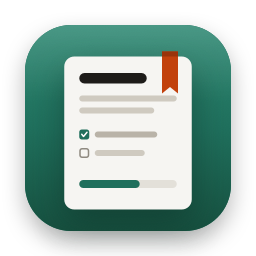

<p align="center"></p>

<h1 align="center">Folio</h1>

<p align="center">macOS için defter → bölüm → not düzeninde, görev ilerlemesi takip eden sade bir not uygulaması.<br>
<em>A calm, native macOS notes app with notebooks, sections, task progress and date filters.</em></p>

---

## Özellikler

- **Defter → Bölüm → Not** hiyerarşisi; defterler renkli, sürükleyerek sıralanır.
- **Akıllı filtreler:** Tüm Notlar, Bugün, Devam Edenler, Sabitlenenler (⌘1–4).
- **Görevler ve ilerleme:** not içindeki görevlerden otomatik durum (Başlanmadı / Devam ediyor / Tamamlandı), elle *Bloke* işaretleme, hedef tarihler, gecikme uyarısı.
- **Tarih filtresi:** Tümü / Bugün / Bu Hafta / Bu Ay / Özel aralık; liste BUGÜN, DÜN, BU HAFTA… başlıklarıyla gruplu.
- **Global arama (⌘F):** başlık, gövde ve görevlerde; eşleşmeler vurgulanır. Türkçe i/ı duyarsız.
- **Son Silinenler:** silinen notlar 90 gün saklanır, sonra otomatik silinir; geri yüklenebilir.
- **Sürükle-bırak:** notları bölümler arasında ya da çöpe taşıma.
- **Kaydırarak silme:** trackpad'de notu sola kaydırınca Sil düğmesi açılır; uzun kaydırma doğrudan siler (onaylı).
- Açık/koyu tema, klavyeyle gezinme, pencere ve sütun genişliklerini hatırlama.
- Üçüncü parti bağımlılık yok: Swift 6, SwiftUI, SwiftData.

## Kurulum (DMG)

1. [Releases](../../releases) sayfasından `Folio-x.y.dmg` dosyasını indirin.
2. DMG'yi açın, **Folio**'yu **Applications** klasörüne sürükleyin.
3. İlk açılış: Folio henüz Apple tarafından notarize edilmedi, bu yüzden macOS ilk açılışta engeller.
   **Sistem Ayarları → Gizlilik ve Güvenlik** sayfasının altındaki **"Yine de Aç"** düğmesine basın.
   (Bu yalnızca bir kez gerekir.)

İndirilen dosyanın bütünlüğünü sürüm notlarındaki SHA-256 ile doğrulayabilirsiniz:

```bash
shasum -a 256 Folio-0.1.dmg
```

> **Not:** DMG sürümü iCloud senkronu içermez; notlar yalnızca bu Mac'te, uygulamanın sandbox klasöründe saklanır.
> iCloud senkronu Developer ID ile imzalanmış bir dağıtım gerektirir.

Gereksinim: macOS 14 Sonoma veya üstü, Apple Silicon ya da Intel.

## Kaynaktan derleme

Gereksinimler: Xcode 26+, [XcodeGen](https://github.com/yonaskolb/XcodeGen) (`brew install xcodegen`).

```bash
git clone <depo-adresi> && cd Folio
cp Config/Local.xcconfig.example Config/Local.xcconfig   # DEVELOPMENT_TEAM'i doldurun
xcodegen generate
open Folio.xcodeproj
```

- `./scripts/ci.sh test` — imzasız derleme ve testler (60+ Swift Testing testi).
- `./scripts/make-dmg.sh` — Release derleme, hardened runtime ile imzalama ve `dist/` altına DMG.
- `swift scripts/make-icon.swift Folio/Resources/Assets.xcassets/AppIcon.appiconset` — uygulama simgesini yeniden üretir.

iCloud senkronu için kendi CloudKit container'ınızı oluşturup `Folio/Folio.entitlements` ve
`ModelContainer+Folio.swift` içindeki `iCloud.com.talha.folio` değerini değiştirin.

## Proje yapısı

```
Folio/
  App/            Uygulama girişi, menü komutları, ModelContainer
  Models/         SwiftData modelleri, çöp kutusu ve sıralama işlemleri
  Features/       Sidebar, NoteList, Editor, Filters, Search
  DesignSystem/   Renk/tipografi/ölçü token'ları ve bileşenler
FolioTests/       Swift Testing testleri
design/           Tasarım token'ları (tokens.json) ve hedef görünüm
```

Geliştirme kuralları için [CLAUDE.md](CLAUDE.md), güvenlik için [SECURITY.md](SECURITY.md).

## Lisans

[MIT](LICENSE) © 2026 Talha Gölcügezli
